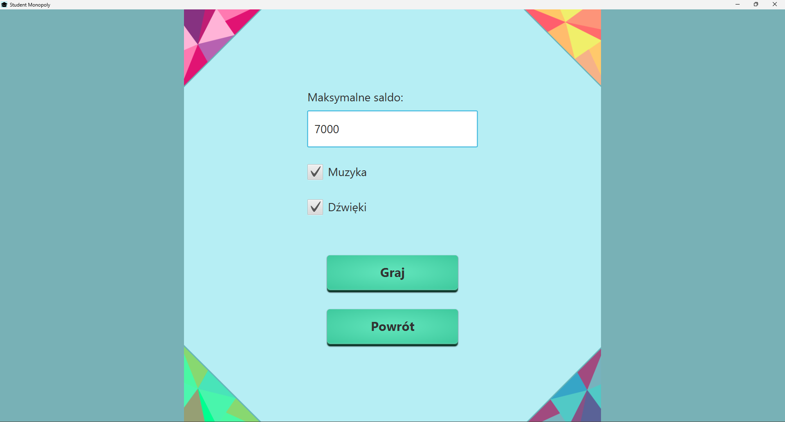

# Monopolowy
Projekt PIO i KCK
Po uruchomieniu gry wszystkie zasady można poznać po kliknięciu w przycisk "Zasady gry". Można tam przeczytać jak 
działa cała gra, jak działają poszczególne pola na planszy i przyciski. Gra kończy się, kiedy jeden z graczy 
osiągnie wpisaną w menu ilość pieniędzy.

